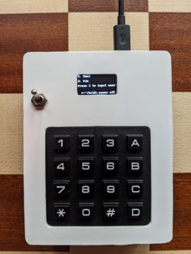
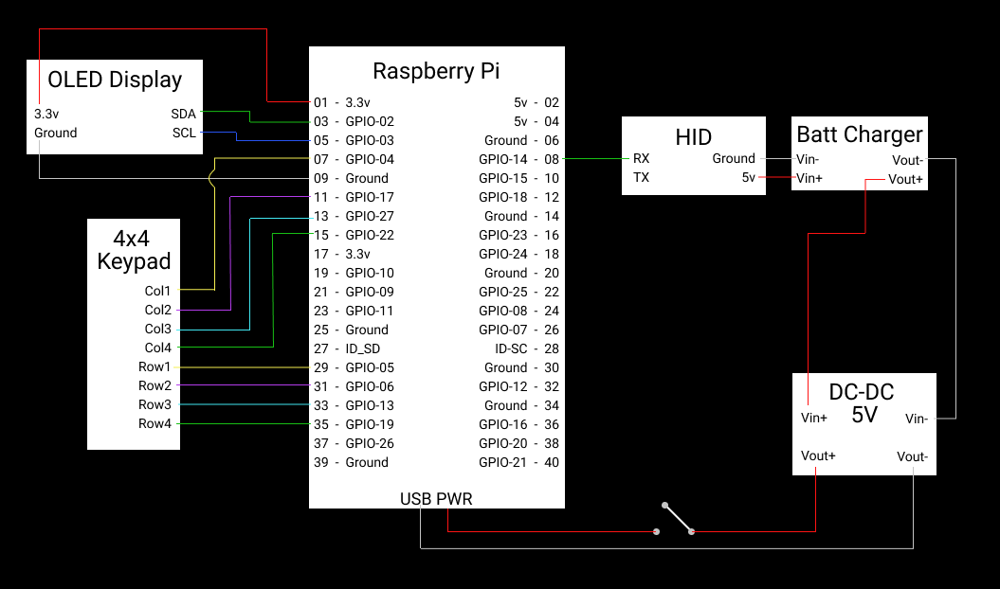
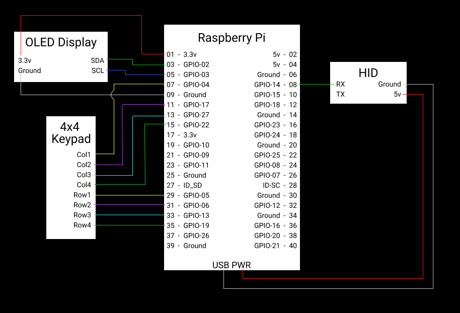
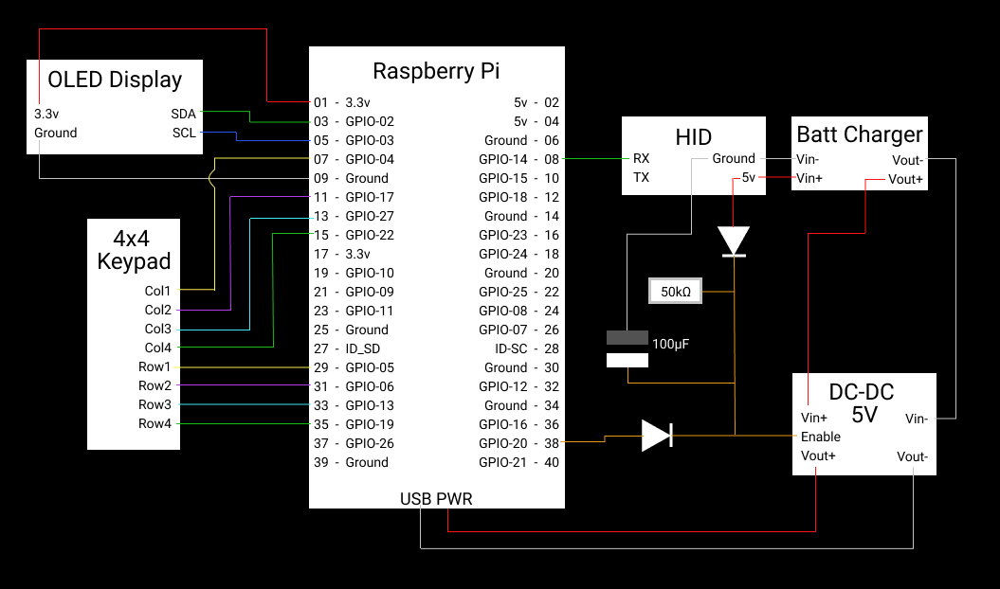

[< TOC/README](../README.md)
# Hardware Password Manager: Build

At the moment there is only the prototype build (V1) and some of the code is hardcoded for these parts (looking to improve this to be more flexible on next release).

## Device V1 (prototype) 

### Parts list:
- Raspberry Pi A v1.1 (any model should work)
- Arduino Micro (can use any USB HID controller. Raspberry Pi Pico is not recommended because reprogrammable via USB anytime it's connected. Another consideration is some HID's won't work at boot time)
- 4x4 Keypad Matrix 
- 126x64 OLED SPI Display ssd1306 
- Optional (recommended as it acts as a UPS):
    - On/off toggle switch
        - I have designed an alternative for this. Using a DC-DC 5V stepup convertor with an enable pin (which I didn't have for the prototype) means the device will turn on when the Arduino is plugged in. When  the Arduino is unplugged the battery will continue supplying power to the Pi until the enable is pulled low (see diagram [v1-circuit-c.png](./assets/v1/v1-circuit-c.png))
    - Battery
    - Battery charging circuit  
    - DC-DC 5V stepup convertor
- Micro SD card (4GB+)
- Housing for the project (either 3d printed or something you can shape/cut into)

### Tools:
- Networked Raspberry Pi (makes things simpler when setting up SD card/Installing dependencies)
- Soldering iron (or someway of making connections)

    
<h3>v1-circuit-a: with battery and power switch:</h3>

    
<h3>v1-circuit-b: without battery and power switch:</h3>

    
<h3>v1-circuit-c: with enable pin/auto power:</h3>

    * Note: I've not yet tested this or added the enable pin from the Pi to the code or setup, so this might take some adjustments to get working *

  
--------------------------------------------

[Hardware Password Manager: Install](./install.md)